## Introduction 

The measurement of pressure and vacuum plays an extensive and important role in the modern world. The industrial revolution was largely powered by the pressure generated by transforming water into steam, and the need to measure pressure, over wider ranges and with increasing accuracy, has expanded ever since. Applications are found in industries as diverse as nuclear, power, gas, petrochemical, biological, pharmaceutical, meteorological, automotive, environmental, semi-conductor, optical, aerospace, defence, ventilation, filtration and process control in general. The validity of the measurements is essential for trade, efficiency, quality and safety.

Pressure and Vacuum Plant design purpose to identify the variation in static and dynamic characteristics. We have different device communication protocols, manufacturers, accuracy and response time. It will be helpful for future research and selection of an accurate sensor for a particular application area. Here we are doing experiments with 9 pressure transmitters and 5 vacuum transmitters which has different properties.

#### Pressure & vacuum Pilot Plant Insight

The Pressure vacuum Pilot Plant hardware contain the combined setup, but it is operated individually. Both plant has same PLC. Pressure setup has 0 to 10 bar three phase compressor and 9 different properties pressure transmitters (PT1 to PT9 and reference slandered is PT3). Vacuum setup has three phase 0 to -1000 mbar vacuum pump. It has 5 different properties vacuum transmitters VT1 to VT5 and reference standard is VT3.

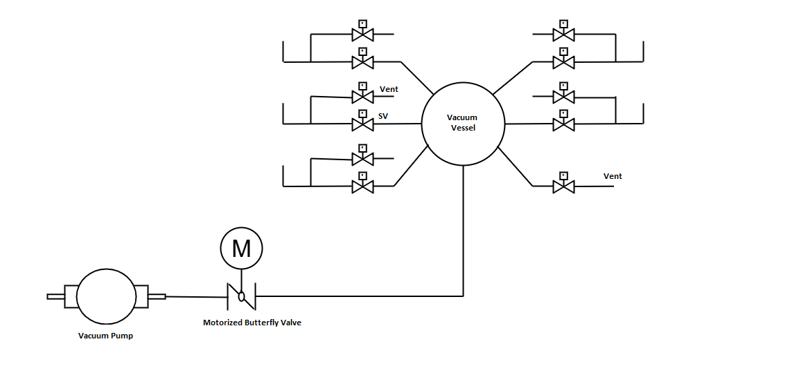

Piping Diagram of Vacuum System

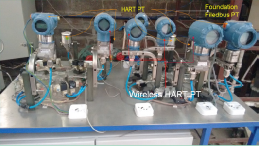

Pressure Vaccum Plant Setup

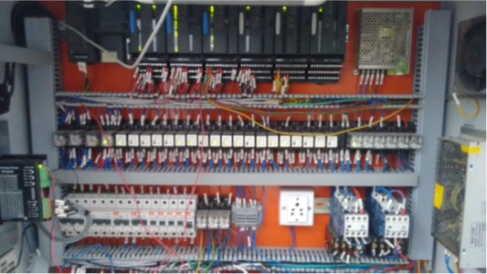

Pressure and Vacuum plant control panel setup

#### Pressure plant description

Pressure setup has different manufacturer and device communication protocols transmitters.

-	Foundation fieldbus pressure transmitter 1 (PT1)
-	ABB HART pressure transmitter 2 (PT2)
-	Forbs marshal pressure transmitter 3 (PT3)
-	Baumar pressure transmitter 4 (PT4)
-	Rosemount HART pressure transmitter 5 (PT5)
-	Rosemount HART pressure transmitter 6 (PT6)
-	Rosemount wireless HART pressure transmitter 7 (PT7)
-	Rosemount wireless HART pressure transmitter 8 (PT8)
-	Rosemount wireless HART pressure transmitter 9 (PT9)
-	Smart Wireless Gateway
-	GE Versa Max PLC
-	Ethernet switches
-	Engineering station
-	Modbus RTU to TCP=IP converter
-	0 to 10 bar three phase air compressor
-	9 3/2 solenoid valve (SV1 to SV9)
-	1 3/2 Air pressure isolation solenoid valve 0 (AP - ISV0)
-	Air vessel drain solenoid valve 10 (AV - DSV10)
-	Compressor unloading solenoid valve 11 (COMP - USV11)

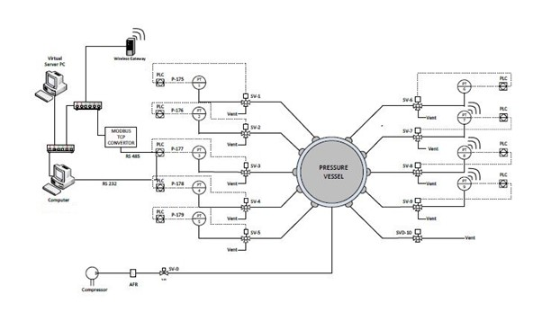

Pressure plant communication and piping & Instrument Diagram

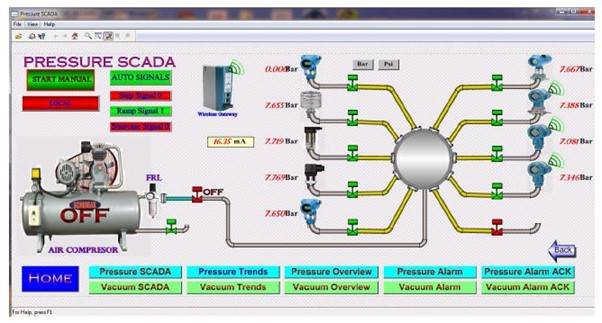

Pressure plant operator SCADA

#### Vacuum plant description

Vacuum setup has different manufacturer and device communication protocols transmitters.

-	Baumar vacuum transmitter 1(VT1)
-	ABB HART vacuum transmitter 2 (VT2)
-	Forbs marshal vacuum transmitter 3 (VT3)
-	Rosemount wireless HART vacuum transmitter 4 (VT4)
-	Rosemount HART vacuum transmitter 5 (VT5)
-	Smart Wireless Gateway
-	GE VersaMax PLC
-	Ethernet switches
-	Engineering station
-	Modbus RTU to TCP=IP converter
-	0 to -1000 bar three phase air compressor
-	5 2/2 solenoid valve (SV1 to SV5)
-	5 2/2 Vacuum drain solenoid valve (VDSV1 to VDSV5)
-	1 2/2 Vacuum vessel drain solenoid valve (VVDSV6)
-	Butterfly valve
-	Stepper motor

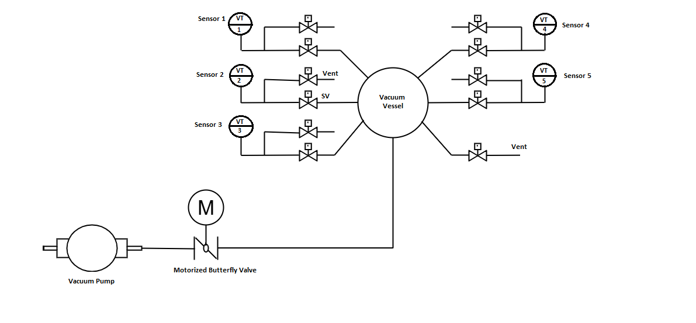

Vacuum plant communication and piping & Instrument Diagram

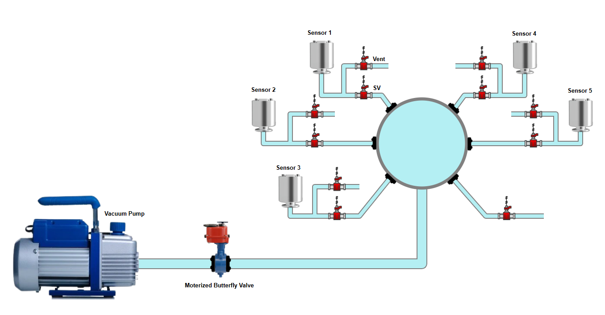

Vacuum Mimic Diagram

Pressure and Vacuum plant Components

Air Compressor

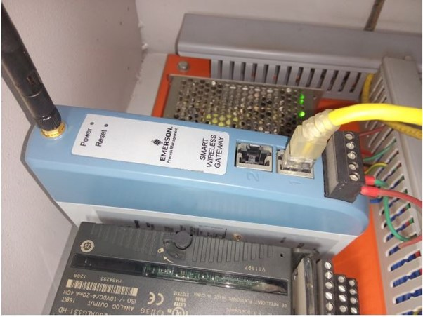

Smart Wireless Gateway

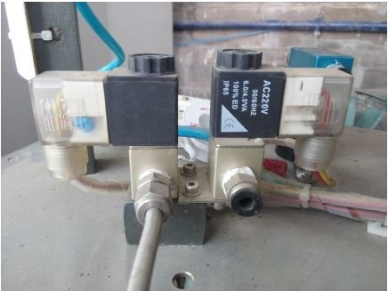

Solenoid Valve 2v2

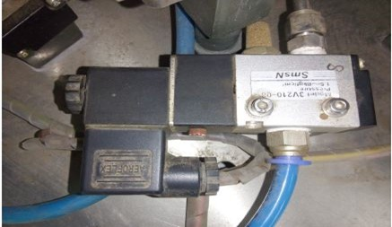

Solenoid Valve 3v2

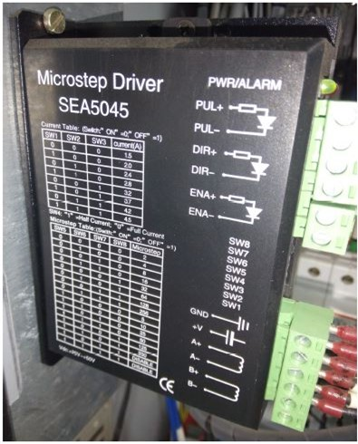

Stepper Motor Drive

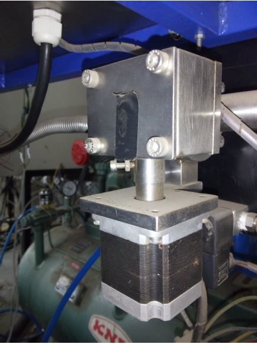

Stepper Motor operated butterfly valve

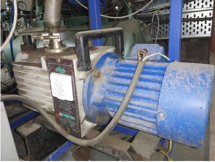

Vacuum Pump

	

